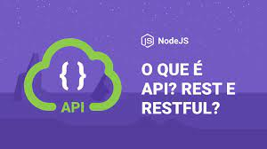

# API, REST e RESTFUL


## About
This repository is for studies about API standards, REST and than turn it in RESTful. You can find the videos to this repository on [Rocketseat Channel](https://www.youtube.com/watch?v=ghTrp1x_1As&list=WL&index=56&ab_channel=Rocketseat) on Youtube.


## How to Download the API Folder
If you want to download this repository just follow the steps below:


1. Copy the url from your browser;
2. Replace the 'tree/main' or 'tree/master' with trunk;

Example: 
> https://github.com/User/somerepo/tree/main/folderyouwant 

> https://github.com/User/somerepo/trunk/folderyouwant 

3.Go to the command Line and just grab the folder with SVN

```sh
    svn checkout https://github.com/User/somerepo/trunk/folderyouwant 
```
## How to use?
To test this small API you can just watch the videos or just download this repo and use the commands bellow:

1. Create a folder to place the files from this repository, then use this command.

```sh
yarn init -y
```
2. Will appear the node_modules folder and package.json files. Use this command to add express:

```sh
yarn add express
```

3. Start the server with this command:
   ```sh
   node server.js
   ```
4. Download the Insomnia Application
5. Create a Folder 'Clients'
6. Create a Request 'GET'
7. Add the url: http://localhost:3000/clients

You gonna see the response with all clients.

From now you can use the routes to make your test. 

## Technologies Used
On this small API were used this techonologies

- JavaScript
- JSON
- Node
- Express
  


## Tools
For this small client API you need to have
- Visual Studio Code
- Insomnia


## What's a API?

API is Application Programming Interface, it purpose is to take care between the Client APP resquest and  API server response. In another words it's how a Client App can get information from another Application and run that inside their aplications. 

In portuguese: Acronimo de Aplication Programming Interface (Interface de Programção de Aplicações) é basicamente um conjunto de rotinas e padrões estabelecidos por uma aplicação, para que outras aplicações possam utilizar as funcionalidades destas aplicação.


- Responsible for stablishe connection between differents services.
- Middleware between technologys
- Intermediary for exchange of informations.


## What's REST?

REST is Representational Stational Transfer, so REST requires some protocol to this be implemented.

### 6 Requirements (constraints) to be a  RESTful

- Client-Server_: Separate client and database, and by that we can have portability on our system, using React on Web and React Native on Mobiles. 

- _Stateless_: Every request that a client does to a server should contain all informations required for the server understand and response and understand the requests.

Example: The user session need to send on every request to know if this user are authenticate and able to use the services, and the server aren't allowed to remember his past authenticates. On our courses we use Tokens for comunication.

- _Cacheable_: The responses to a request need to be explicity about the request been able or not to be cacheable by Client. 

- _Layered System_: O cliente acessa a um endpoint, sem precisar saber da complexidade, de quais passos estão sendo necessários para o servidor responder a requisição, ou quais outras camadas o servidor estará lidando, para que a requisição seja respondida.

- _Code on demand(optional)_: Give us the possibility of our application get code, like JavaScript and apply on client-side.

So RESTful, is a application on REST standards.


## Good pratices will be implemented along the code.

 - Use verbs HTTP for our requests
 - Use plural or ssingular on endpoints creation? This doesn't matter implement a standard
 - Dont leave '/' on the final endpoint.
 - Never leave your client without response.

### Verbs HTTP 
GET : Receive data from a Resource
POST : Send data or informaton to be proccessed by a Resource.
PUT  : Refresh a data from a Resource
DELETE : Delete a Resource


## Response Status

- 1xx: Information
- 2xx: Success 
    - 200: Ok
    - 201: Created
    - 204: Don't Have information PUT,POST and DELETE. 
- 3xx: Redirection
- 4xx: Client Error
    - 400: Bad Request
    - 404: Not Found!
- 5xx: Server Error
    - 500: Internal Server Error