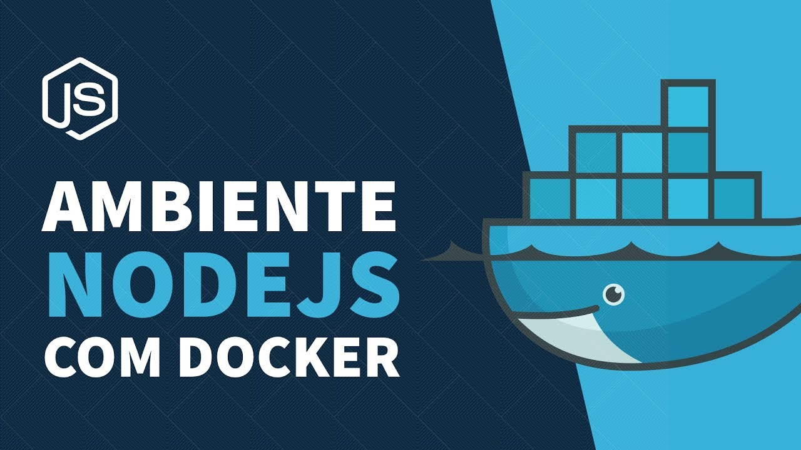

<h1 align="center">Bem vindo aos estudos do Docker 👋</h1>



<p align="center">
  <a href="#about">Sobre</a>&nbsp;&nbsp;&nbsp;|&nbsp;&nbsp;&nbsp;
  <a href="#como-usar">Como Usar</a>&nbsp;&nbsp;&nbsp;|&nbsp;&nbsp;&nbsp;
  <a href="#-tecnologias">Tecnologias</a>&nbsp;&nbsp;&nbsp;|&nbsp;&nbsp;&nbsp;
  <a href="#autor">Autor</a>&nbsp;&nbsp;&nbsp;|&nbsp;&nbsp;&nbsp;
  <a href="#-licença">Licença</a>
</p>

# Sobre
> Neste estudo foi testado como utilizar a tecnologia docker para criar container a qual pudessemos configurar ambientes de desenvolvimento para nossas aplicações, assim podemos evitar que uma aplicação afetasse a outra. Este estudo foi desenvolvido pela Rocketseat no seguinte video [aqui](https://www.youtube.com/watch?v=AVNADGzXrrQ&list=PL-0rTJZW_Fs3F9vuu7HsE3rJVXlidgmMx&index=10&ab_channel=Rocketseat).


## Como Usar
If you want download this folder from this repository just follow this steps below:


1. Copy the url from your browser;
2. Replace the 'tree/main' or 'tree/master' with trunk;

Example: 
> https://github.com/User/somerepo/tree/main/folderyouwant
 
> https://github.com/User/somerepo/trunk/folderyouwant 

3.Go to the command Line and just grab the folder with SVN

```sh
    svn checkout https://github.com/User/somerepo/trunk/folderyouwant 
```


## 🚀 Tecnologias
This Project was developed using the following technologies:

- JavaScript
- NodeJS
- Docker


## Ferramentas
On this project were used those tools:

- Visual Studio
- WebBrowser

## Autor

👤 **Alberto Junior**


* Github: [Alberto Júnior](https://github.com/wayfiding)
* LinkedIn: [Alberto Souza](https://linkedin.com/in/alberto-souza)


## Show your support

Give a ⭐️ if this project helped you!

## 📝 Licença

Copyright © 2021 [Alberto Junior](https://github.com/wayfiding).<br />
This project is [MIT](https://github.com/Wayfiding/Rocketseat/blob/main/LICENSE) licensed.

***
_This README was generated with ❤️ by [readme-md-generator](https://github.com/kefranabg/readme-md-generator)_