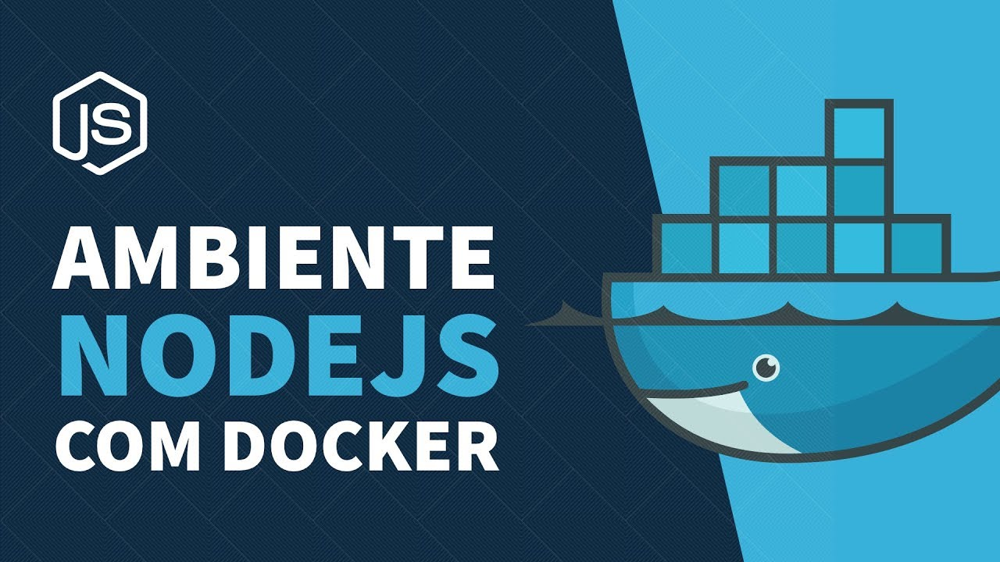

<h1 align="center">Welcome to Docker Studies 👋</h1>



<p align="center">
  <a href="#about">About</a>&nbsp;&nbsp;&nbsp;|&nbsp;&nbsp;&nbsp;
  <a href="#how-to-use">How to Use</a>&nbsp;&nbsp;&nbsp;|&nbsp;&nbsp;&nbsp;
  <a href="#-technologies">Technologies</a>&nbsp;&nbsp;&nbsp;|&nbsp;&nbsp;&nbsp;
  <a href="#author">Author</a>&nbsp;&nbsp;&nbsp;|&nbsp;&nbsp;&nbsp;
  <a href="#-license">License</a>
</p>

Languages:

[Portuguese :brazil:](README-ptbr.md)

# About
> On this studie were tested how to use Docker technology to create containers which we can configure a develop environment for our applications, so we can avoid that one application affect the other. This study was developed by Rocketseat on the following video [here](https://www.youtube.com/watch?v=AVNADGzXrrQ&list=PL-0rTJZW_Fs3F9vuu7HsE3rJVXlidgmMx&index=10&ab_channel=Rocketseat).


## How to Use
If you want download this folder from this repository just follow this steps below:


1. Copy the url from your browser;
2. Replace the 'tree/main' or 'tree/master' with trunk;

Example: 
> https://github.com/User/somerepo/tree/main/folderyouwant
 
> https://github.com/User/somerepo/trunk/folderyouwant 

3.Go to the command Line and just grab the folder with SVN

```sh
    svn checkout https://github.com/User/somerepo/trunk/folderyouwant 
```


## 🚀 Technologies
This Project was developed using the following technologies:

- JavaScript
- NodeJS
- Docker


## Tools
On this project were used those tools:

- Visual Studio
- WebBrowser

## Author

👤 **Alberto Junior**


* Github: [Alberto Júnior](https://github.com/wayfiding)
* LinkedIn: [Alberto Souza](https://linkedin.com/in/alberto-souza)


## Show your support

Give a ⭐️ if this project helped you!

## 📝 License

Copyright © 2021 [Alberto Junior](https://github.com/wayfiding).<br />
This project is [MIT](https://github.com/Wayfiding/Rocketseat/blob/main/LICENSE) licensed.

***
_This README was generated with ❤️ by [readme-md-generator](https://github.com/kefranabg/readme-md-generator)_