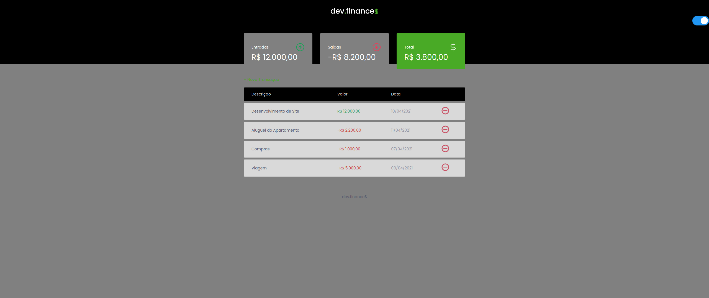

<h1 align="center">Welcome to Maratona 1 👋</h1>

 

<p>
  
  <a href="Teste" target="_blank">
    
  </a>
  <a href="https://img.shields.io/github/license/wayfiding/ROCKETSEAT?color=MIT&logo=MIT&logoColor=MIT&#34" target="_blank">
    
  </a>
  
</p>
<div align="right">
Languages:

[Portuguese :brazil:](README-ptbr.md)

</div>

<p align="center">
  <a href="#💻-project">Project</a>&nbsp;&nbsp;&nbsp;|&nbsp;&nbsp;&nbsp; 
  <a href="#🚀-technologies">Technologies</a>&nbsp;&nbsp;&nbsp;|&nbsp;&nbsp;&nbsp;
  <a href="#🔖-layout">Layout</a>&nbsp;&nbsp;&nbsp;|&nbsp;&nbsp;&nbsp;
  <a href="#📝-license">License</a>
</p>

## 💻 Project
 On this project were build a mini financial system, the process to do this can be viewed on [Rocketseat Platform](https://app.rocketseat.com.br). This project is part of a program developed by Rocketseat to help people learn the Front-End technologies.

## 🚀 Technologies
This Project was developed using the following technologies:

- HTML
- CSS
- **JavaScript**


## 🔖 Layout

Você pode visualizar o layout do projeto através [desse link](https://www.figma.com/file/7Vu9DzUaCZIV4nibzkjgB4/dev.finance%24-Maratona-Discover/duplicate?node-id=0%3A1). É necessário ter conta no [Figma](https://figma.com) para acessá-lo.


### 🏠 [Homepage](Teste)


## How to use:
If you want download this folder from this repository just follow this steps below:


1. Copy the url from your browser;
2. Replace the 'tree/main' or 'tree/master' with trunk;

Example: 
> https://github.com/User/somerepo/tree/main/folderyouwant
 
> https://github.com/User/somerepo/trunk/folderyouwant 

3.Go to the command Line and just grab the folder with SVN

```sh
    svn checkout https://github.com/User/somerepo/trunk/folderyouwant 
```


## Usage
After download the folder you can just open the index.html with your browser or open with Visual Studio Code and on the side bar click with the right-button of your mouse and select the Open Preview option. 

To use the 'Open Preview' will be required to you to install the Live-Server extension on your Visual Studio Code Software.


## Author

👤 **Alberto Junior**


* Github: [Alberto Júnior](https://github.com/wayfiding)
* LinkedIn: [Alberto Souza](https://linkedin.com/in/alberto-souza)


## Show your support

Give a ⭐️ if this project helped you!

## 📝 License

Copyright © 2021 [Alberto Júnior](https://github.com/Teste).<br />
This project is [MIT](https://img.shields.io/github/license/wayfiding/ROCKETSEAT?color=MIT&logo=MIT&logoColor=MIT&#34) licensed.

***
_This README was generated with ❤️ by [readme-md-generator](https://github.com/kefranabg/readme-md-generator)_