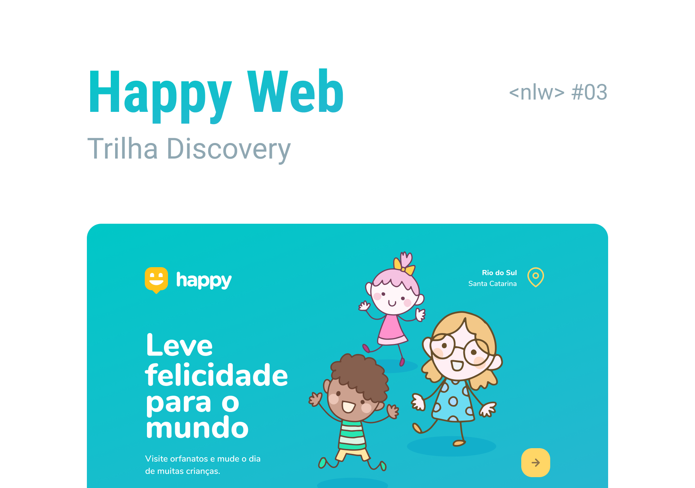

<h1 align="center">
  
</h1>





<h1 align="center">Welcome to Happy Web 👋</h1>
<p align="center">
  
  <a href="Teste" target="_blank">
    
  </a>
  <a href="Teste" target="_blank">
    
  </a>
  
</p>


<div align="center">
Languages:

[Portuguese :brazil:](README-ptbr.md)

</div>
This project was developed during the Next Level Week and the aim of this project was to bring happiness to orphan childs visiting them.

The project could not be finished because I could not watch all the event, yet I'm still looking to finish it.

### 🏠 [Homepage](Teste)

### ✨ [Demo](Teste)

## Install

```sh
Teste
```

## Usage

```sh
TEste
```

## Run tests

```sh
Teste
```

## Author

👤 **Alberto Júnior**

* Website: Teste
* Twitter: [@Teste](https://twitter.com/Teste)
* Github: [@Teste](https://github.com/Teste)
* LinkedIn: [@Teste](https://linkedin.com/in/Teste)

## 🤝 Contributing

Contributions, issues and feature requests are welcome!<br />Feel free to check [issues page](Teste). You can also take a look at the [contributing guide](Teste).

## Show your support

Give a ⭐️ if this project helped you!

## 📝 License

Copyright © 2021 [Alberto Júnior](https://github.com/Wayfiding).<br />
Esse projeto está sob a licença MIT. Veja o arquivo [LICENSE](.github/LICENSE.md) para mais detalhes.

***
_This README was generated with ❤️ by [readme-md-generator](https://github.com/kefranabg/readme-md-generator)_