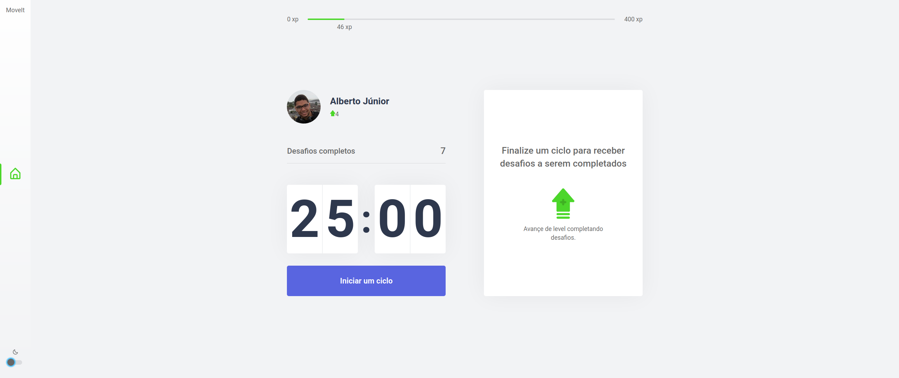

<h1 align="center">
  
</h1>

<p>
  
  <a href="https://github.com/Wayfiding/Rocketseat/blob/main/serie-node/README.md" target="_blank">
    
  </a>
  <a href="https://img.shields.io/github/license/wayfiding/ROCKETSEAT?color=MIT&logo=MIT&logoColor=MIT" target="_blank">
    
  </a>
</p>


 
<p align="center">
 <a href="#page_facing_up-about">About</a> •
 <a href="#dart-function">Function</a> •
 <a href="#space_invader-how-to-use-this-application">How to use this application</a> •
 <a href="#application">Technologies Used</a> •
  <a href="#tools">Application Layout and Tools</a> •
</p>

### 🏠 [Hospedagem](https://react-nlw4-5oqkmuw3d-wayfiding.vercel.app/)
>Click on the link above to see this aplication.

## :page_facing_up: About
This project is cronometer that use the pomodoro technique and at the end of each cycle the user receives a challenge, this challenges has the purpose of reduct the injuries for repetitive movement. That application was developed during NLW#4 - React Track, offered by Rocketseat over 5 days of marathon.


## :dart: Function

This application requires a permition to send notification, which need to be allowed by the user. It function ís notify the user the end of the cycle. In addition of this sound notification there is visual notification.

When the cycles focus ends, the user is informed by a new challenge and his points, case the user accomplish this poits will be summed bring him to the next level, otherwise, his level and experience will be the same.

For Each level advance are exhibited a modal with the new level achieved. If the page is update, the information will be recovered by the cookies.


## :space_invader: How to use this application

### Prerequisite

You need to have this softwares on yout machine:
* [Node.js](https://nodejs.org/en/)
* [VSCode](https://code.visualstudio.com/) - Code Edit recommended


### Execute this Application

### Download this folder from Github repository
```
svn checkout  https://github.com/Wayfiding/Rocketseat/trunk/NLW/NLW%234/React/moveit-next

```

#### **Access this folder from terminal:**

```sh
cd moveit-next
```
#### **Install the dependencies**
 
**npm**  
```sh 
npm install
```
or

**yarn**
```sh 
npm install -g yarn
```

#### **Usage**

**npm** 
```sh
npm run dev
```
or

**yarn**
```sh
yarn dev
```

#### **Run tests**

```sh
Access http://localhost:3000, to use this application
```
## Application
This application was developed with:

• [ReactJS](https://pt-br.reactjs.org/) 
• [Next.js](https://nextjs.org/) 
• [TypeScript](https://www.typescriptlang.org/) 
• [js-cookie](https://github.com/js-cookie/js-cookie)

## Tools
• Editor de código -> [VSCode](https://code.visualstudio.com/)
• Fontes -> [Inter](https://fonts.google.com/specimen/Inter) & [Rajdhani](https://fonts.google.com/specimen/Rajdhani)
• Prototipagem -> [Figma](https://www.figma.com/)
## Author

👤 **Alberto Junior**

* Website: (https://react-nlw4-5oqkmuw3d-wayfiding.vercel.app/)

## Show your support

Give a ⭐️ if this project helped you!

## 📝 License

Copyright © 2021 [Alberto Junior](https://github.com/On Test).<br />
This project is [MIT]() licensed.

***
This README was generated with ❤️ by [readme-md-generator](https://github.com/kefranabg/readme-md-generator) and took some tips from [@gabjohann](https://github.com/gabjohann).
