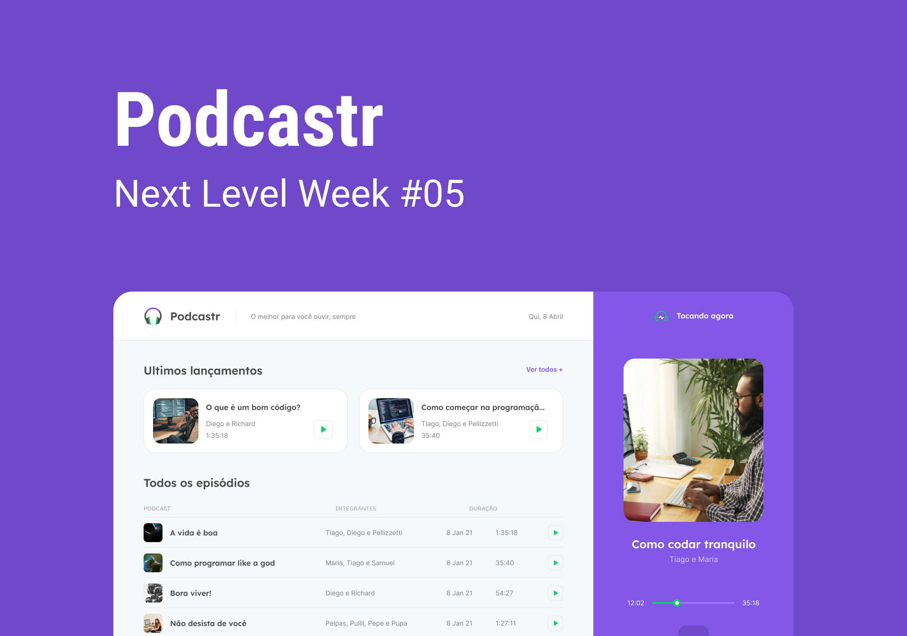

<h1 align="center">
  
</h1>




<p>
  
  <a href="Teste" target="_blank">
    
  </a>
  <a href="Teste" target="_blank">
    
  </a>
  
</p>
<p align="center">
  <a href="#how-to-use">How to Use</a>&nbsp;&nbsp;&nbsp;|&nbsp;&nbsp;&nbsp;
  <a href="#-technologies">Technologies</a>&nbsp;&nbsp;&nbsp;|&nbsp;&nbsp;&nbsp;
  <a href="#author">Author</a>&nbsp;&nbsp;&nbsp;|&nbsp;&nbsp;&nbsp;
  <a href="#-license">License</a>
</p>
 
The Podcastr was developed during the Next Level Week 5, promoted by Rocketseat. It's a platform were you can listening the episodes from Podcast "Talk Dev" and see a description about it episode content.


## How to Use
If you want download this folder from this repository just follow this steps below:


1. Copy the url from your browser;
2. Replace the 'tree/main' or 'tree/master' with trunk;

Example: 
> https://github.com/User/somerepo/tree/main/folderyouwant
 
> https://github.com/User/somerepo/trunk/folderyouwant 

3.Go to the command Line and just grab the folder with SVN

```sh
    svn checkout https://github.com/User/somerepo/trunk/folderyouwant 
```

After download that folder you gonna run the below command to start the application:
```sh
npm install
```
or
```sh
yarn 
```
Those command will install and download the required packages to application be able to run correctly.

After that you can choose use npm or yarn to run the application:

```sh
npm run server 
```

```sh
npm run dev
```
For users of yarn :

```sh
yarn server
```
and them: 
```sh
yarn dev
```

The first command will start mini back-end server and the next command will run the application.
## 🚀 Technologies
This Project was developed using the following technologies:


- HTML
- CSS
- JavaScript
- NodeJS
- React
- Next

## Author

👤 **Alberto Junior**

* Github: [Alberto Júnior](https://github.com/wayfiding)
* LinkedIn: [Alberto Souza](https://linkedin.com/in/alberto-souza)

## 🤝 Contributing

Contributions, issues and feature requests are welcome!<br />Feel free to check [issues page](Teste). 

## Show your support

Give a ⭐️ if this project helped you!

## 📝 License
Copyright © 2021 [Alberto Júnior](https://github.com/Wayfiding).<br />
Esse projeto está sob a licença MIT. Veja o arquivo [LICENSE](.github/LICENSE.md) para mais detalhes.

---

Made with ♥ by Rocketseat :wave: [Participe da nossa comunidade!](https://discordapp.com/invite/gCRAFhc)

***
_This README was generated with ❤️ by [readme-md-generator](https://github.com/kefranabg/readme-md-generator) and Alberto